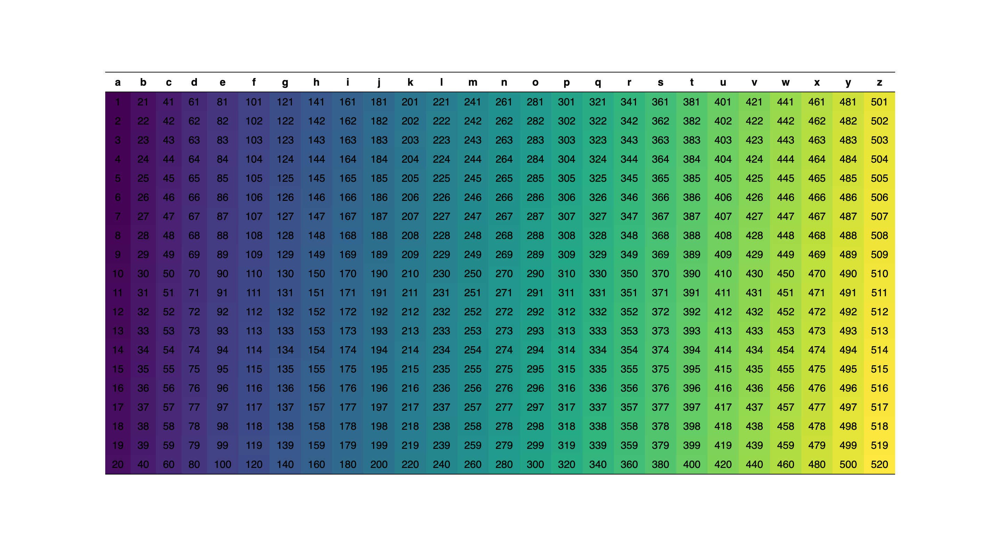

<div>
<a href="https://github.com/cecoeco/HTMLTables.jl/blob/main/LICENSE.md"></a>
<a href="https://github.com/cecoeco/HTMLTables.jl/actions/workflows/CI.yml"></a>
<a href="https://github.com/JuliaDiff/BlueStyle"></a>
<a href="https://zenodo.org/doi/10.5281/zenodo.11253769"></a>
<a href="https://juliapkgstats.com/pkg/HTMLTables"></a>
<a href="https://www.contributor-covenant.org"></a>
</div>

## HTMLTables

<i>Julia package for reading, writing, and viewing HTML tables.</i>

### :book: Documentation

<div>
<a href="https://cecoeco.github.io/HTMLTables.jl/stable/"></a>
<a href="https://cecoeco.github.io/HTMLTables.jl/dev/"></a>
</div>

### :arrow_down: Installation

`using Pkg; Pkg.add("HTMLTables")`

### Examples

writiing a DataFrame into an HTML table:

```julia
using HTMLTables, DataFrames

df = DataFrame(
    "a" => 001:020, "b" => 021:040,
    "c" => 041:060, "d" => 061:080,
    "e" => 081:100, "f" => 101:120,
    "g" => 121:140, "h" => 141:160,
    "i" => 161:180, "j" => 181:200,
    "k" => 201:220, "l" => 221:240,
    "m" => 241:260, "n" => 261:280,
    "o" => 281:300, "p" => 301:320,
    "q" => 321:340, "r" => 341:360,
    "s" => 361:380, "t" => 381:400,
    "u" => 401:420, "v" => 421:440,
    "w" => 441:460, "x" => 461:480,
    "y" => 481:500, "z" => 501:520
)

HTMLTables.write(df, colorscale="viridis")
```

output:



creates a dataframe from parsing an html table from a website:

```julia
using HTMLTables, DataFrames

df = HTMLTables.read("https://www.w3schools.com/html/html_tables.asp", DataFrame)
```

writing the html table data into a CSV file:

```julia
using CSV

CSV.write("table.csv", df)
```

writing the html table data into a JSON file:

```julia
using JSON3, JSONTables

json = JSONTables.objecttable(df)

Base.open("table.json", "w") do io
    JSON3.pretty(io, json)
end
```

writing the html table data into an Excel file:

```julia
using XLSX

XLSX.writetable("table.xlsx", "Sheet 1" => df)
```

### Functions

Reading HTML tables:
- `HTMLTables.get` reads an HTML table as a string based on the given index.
- `HTMLTables.getall` extracts all tables from an HTML document or website.
- `HTMLTables.read` extracts the data from an HTML table using a sink function.
- `HTMLTables.readall` extracts the data from all tables of an HTML document or website.

Writing HTML tables:
- `HTMLTables.table` uses the Tables.jl interface to write an HTML table as a string.
- `HTMLTables.write` uses the Tables.jl interface to write an HTML table in an HTML file.
- `HTMLTables.jpg` writes an HTML table as a JPG image.
- `HTMLTables.pdf` writes an HTML table as a PDF document.
- `HTMLTables.png` writes an HTML table as a PNG image.

Viewing HTML tables:
- `HTMLTables.display` displays a Julia table as an HTML table in a Julia IDE.
- `HTMLTables.open` opens a Julia table as an HTML table in the browser.
