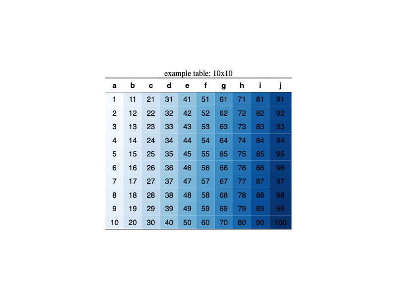

# HTMLTables

Julia package for reading, writing, and viewing HTML tables.

Reading HTML tables:
- `HTMLTables.get` reads an HTML table as a string.
- `HTMLTables.read` extracts data from HTML tables.

Writing HTML tables:
- `HTMLTables.table` uses the Tables.jl interface to write an HTML table as a string.
- `HTMLTables.write` uses the Tables.jl interface to write an HTML table in a file.

Viewing HTML tables:
- `HTMLTables.display` displays a julia table as an HTML table in julia.
- `HTMLTables.open` opens a julia table as an HTML table in the browser.

## example
```julia
using DataFrames, HTMLTables

df = DataFrame(
    "a" => [001, 002, 003, 004, 005, 006, 007, 008, 009, 010],
    "b" => [011, 012, 013, 014, 015, 016, 017, 018, 019, 020],
    "c" => [021, 022, 023, 024, 025, 026, 027, 028, 029, 030],
    "d" => [031, 032, 033, 034, 035, 036, 037, 038, 039, 040],
    "e" => [041, 042, 043, 044, 045, 046, 047, 048, 049, 050],
    "f" => [051, 052, 053, 054, 055, 056, 057, 058, 059, 060],
    "g" => [061, 062, 063, 064, 065, 066, 067, 068, 069, 070],
    "h" => [071, 072, 073, 074, 075, 076, 077, 078, 079, 080],
    "i" => [081, 082, 083, 084, 085, 086, 087, 088, 089, 090],
    "j" => [091, 092, 093, 094, 095, 096, 097, 098, 099, 100]
)

HTMLTables.png(df, filename="example", caption="example table: 10x10", colorscale="Blues")

```
the resulting table:


## License
Copyright © 2024 Ceco Elijah Maples

This work is licensed under the [MIT License](https://opensource.org/license/mit/) - see the [`LICENSE`](LICENSE.md) file for details.